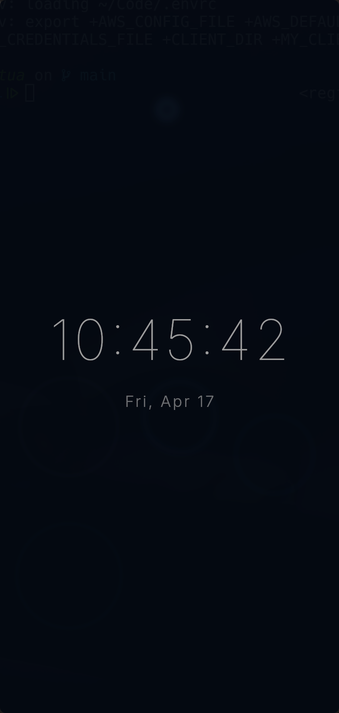
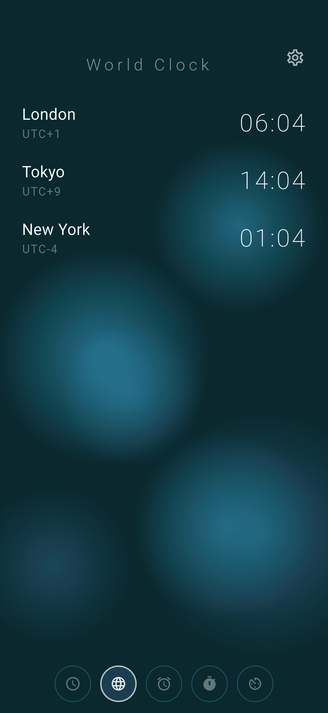
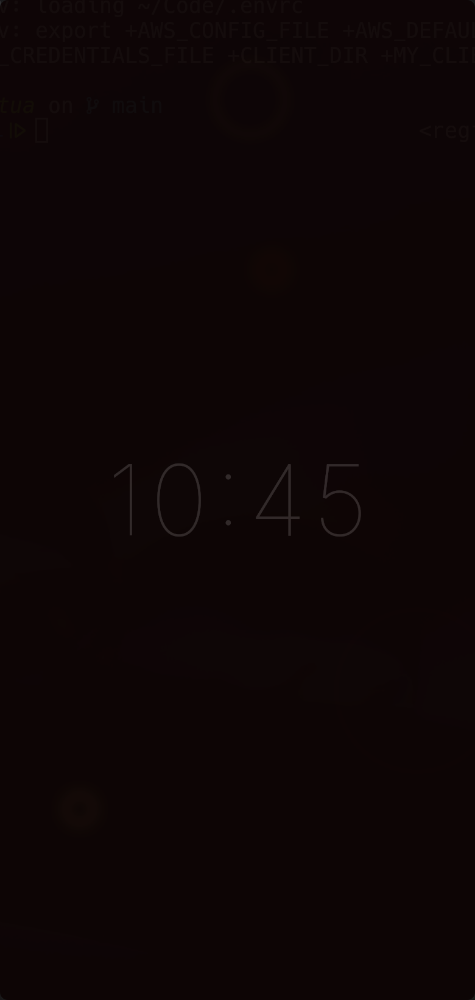
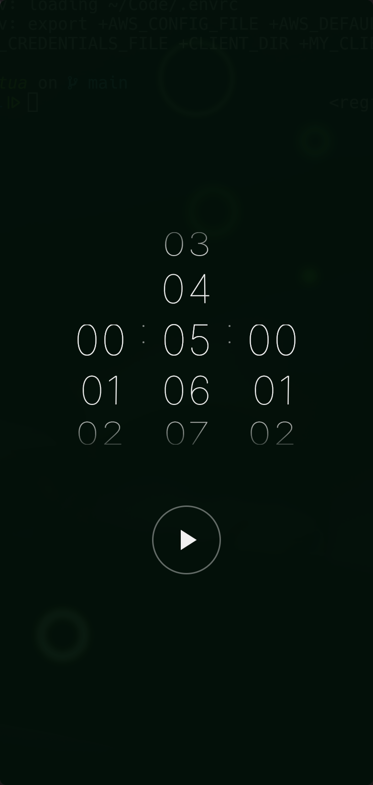
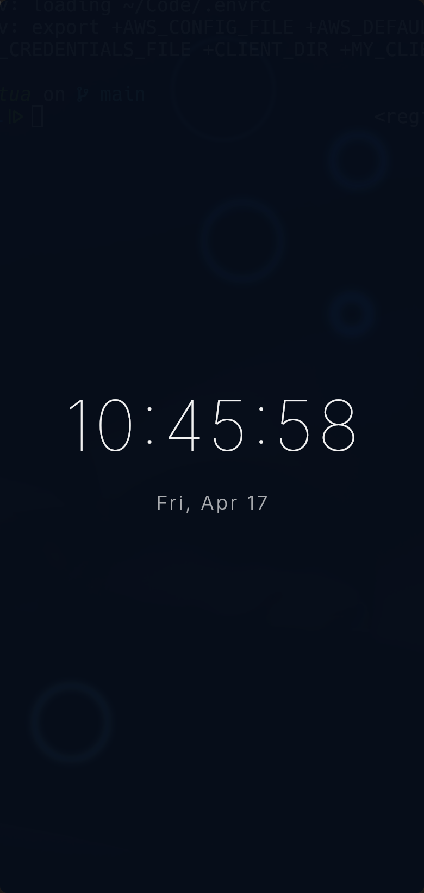
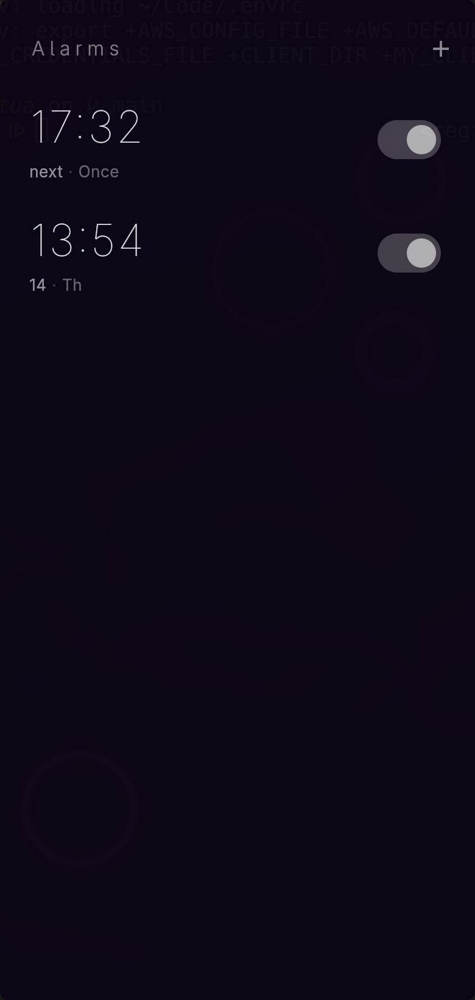
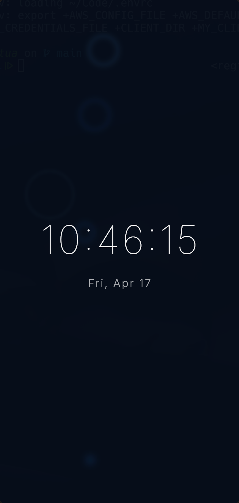
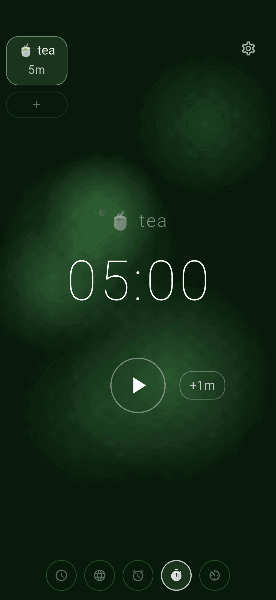

<header class="hero">


# Noctua

**A minimal clock app for Linux desktop and Android.**  
Six screens. Animated backgrounds. Alarms that actually fire.

<nav class="cta-row">
  <a class="btn btn-primary" href="https://github.com/opennomad/noctua">View on GitHub</a>
  <a class="btn btn-secondary" href="#getting-started">Get Started</a>
</nav>

</header>

---

## Screens

Navigate by horizontal swipe, arrow keys, or the icon pills on the right edge.

<div class="screen-grid">

<div class="screen-card">

### Clock

Digital time and date. Configurable font and colour scheme.

</div>

<div class="screen-card">

### World Clock

Search 115 cities or enter a custom UTC offset. Drag to reorder. Live DST-aware display.

</div>

<div class="screen-card">

### Alarm

One-shot and repeating alarms. Day-of-week toggles, labels, Dismiss and Snooze 10 min.

</div>

<div class="screen-card">

### Night Clock

Dimmed full-screen bedside display. Easy on the eyes at 3 AM.

</div>

<div class="screen-card">

### Timer

Scroll-drum input, multiple simultaneous timers, saved presets with emoji names. State persists across restarts.

</div>

<div class="screen-card">

### Stopwatch

Lap recording with a fixed-width layout so digits never shift.

</div>

</div>

---

## Features

<div class="feature-grid">

<div class="feature">

#### Animated Backgrounds
Five styles — Lava Lamp, Raindrops, Wave, Pulse, or None. Density, speed, and amplitude are tunable. A single shared ticker drives all backgrounds simultaneously so they stay in sync.

</div>

<div class="feature">

#### Per-Screen Colour
Full hue slider or named presets (blue, purple, green) for each screen independently.

</div>

<div class="feature">

#### Sound Selection
Android ringtones are enumerated directly from `RingtoneManager`. On Linux, any `.oga` or `.wav` file under `/usr/share/sounds/freedesktop/stereo` is available. Separate pickers for alarm and timer sounds.

</div>

<div class="feature">

#### 24h / 12h Format
One tap in settings. Applies everywhere — Clock, Night Clock, World Clock, and the Alarm list.

</div>

<div class="feature">

#### Saved Timer Presets
Give timers names with `:shortcode:` emoji syntax — `:tea:`, `:pomodoro:`, `:pizza:`. Edge pills (left, right, or bottom) auto-hide after 3 seconds.

</div>

<div class="feature">

#### Keyboard Navigation
Arrow keys cycle screens. Configurable bindings. Automatically disabled while text fields or modals are focused.

</div>

<div class="feature">

#### Settings Overlay
Tap anywhere to reveal the gear icon; it auto-hides after 3 seconds. The settings sheet covers animation style, params, font, per-screen hue, time format, sound, timer-pill edge, and keyboard bindings.

</div>

<div class="feature">

#### Config File
Human-readable JSON at `~/.config/noctua/noctua_config.json` (Linux) or the app documents directory (Android). Hand-edit it if you like.

</div>

</div>

---

## Screenshots


*Settings panel — animation, font, colour, sound, and time format*


*Alarm dismiss sheet — shown when an alarm fires while the app is open*


*Timer screen with saved presets visible*

---

## Getting Started {#getting-started}

### Requirements

| Platform | Minimum |
|----------|---------|
| Linux    | GTK 3, PulseAudio (`paplay`) |
| Android  | API 21 (Android 5.0) |

### Linux (from source)

```bash
git clone https://github.com/opennomad/noctua.git
cd noctua
mise exec -- flutter run -d linux
```

[mise](https://mise.jdx.dev/) manages the Flutter and Dart toolchain. Install it first if you haven't already, then run `mise install` in the project root.

### Android

Connect a device or start an emulator, then:

```bash
mise exec -- flutter run
```

On first launch Noctua will request **notification** and **exact alarm** permissions. Both are required for alarms to fire reliably.

---

## Technical

Built with [Flutter](https://flutter.dev) 3.41 / Dart 3.11.

| Package | Purpose |
|---------|---------|
| `flutter_local_notifications` | Alarm and timer notifications on Android |
| `timezone` | DST-correct world clock and alarm scheduling |
| `google_fonts` | Runtime font loading |
| `path_provider` · `xdg_directories` | Platform config paths |

Source: [github.com/opennomad/noctua](https://github.com/opennomad/noctua)

---

*Noctua — named for the little owl.*
